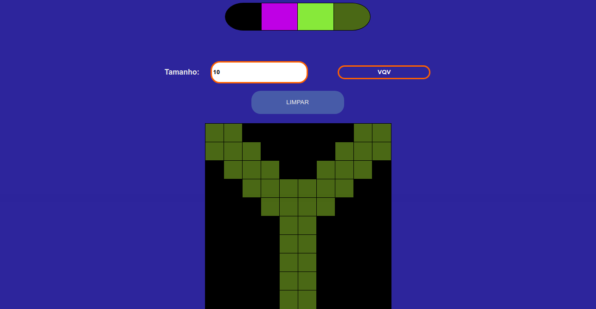

# Projeto Pixel Art

Pixel Art é um projeto idealizado pela Trybe onde temos como tarefa criar uma página web usando HTML5/CSS3/JavaScript, a página tem como objetivo permitir que o cliente escolha o tamanho do quadro de pixels de 5x5 à 50x50 e, escolher entre as cores que são disponibilizadas aleatóriamente(com excessão do primeiro que é a cor padrão) para pintar seu quadro, também tem um botão para limpar o quadro. O tamanho padrão é 5x5 e a cor padrão é preto.

O site foi projetado para um display de 1366 x 768!

## Técnologias utilizadas:

* HTML5
* CSS3
* JavaScript

### Para visualizar basta abrir o link:

https://moisessantana.github.io/pixel-art/
